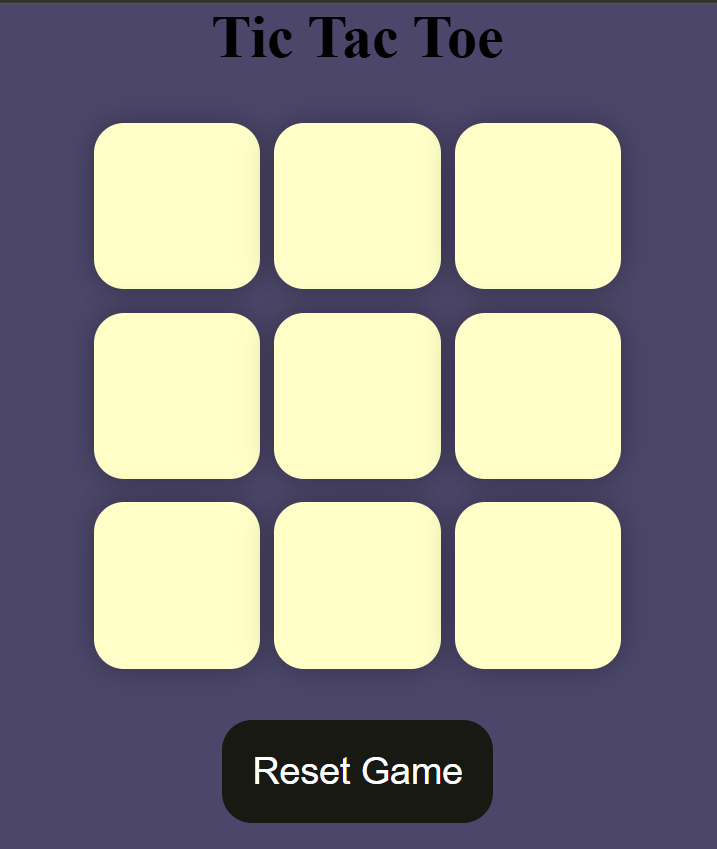

# Tic Tac Toe Game

This is a simple and interactive **Tic Tac Toe game** built using **HTML, CSS, and JavaScript**.  
The game allows two players to play turn by turn in the browser.

---

## Features
- Two-player gameplay
- Interactive UI
- Winning logic implemented
- Reset / New Game option
- Responsive design

---

## Technologies Used
- HTML
- CSS
- JavaScript

---

## How to Play
1. Open the game in your browser
2. Player X starts the game
3. Players take turns clicking on the boxes
4. First player to align 3 symbols (row, column, or diagonal) wins
5. Click **Reset** to play again

---

## Screenshots

